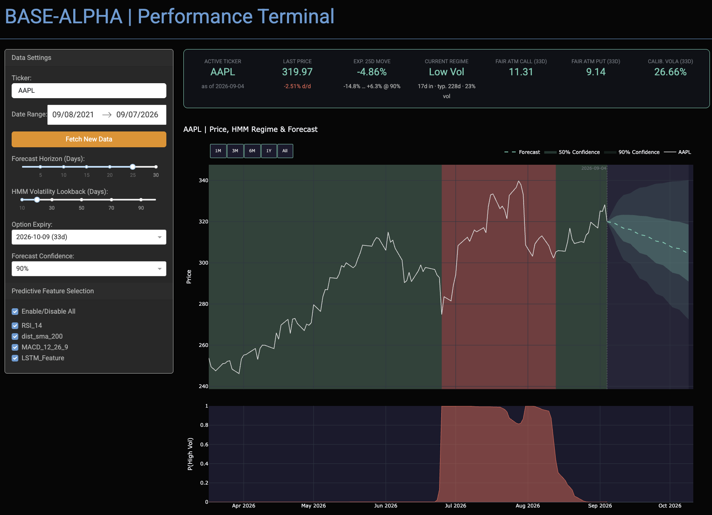
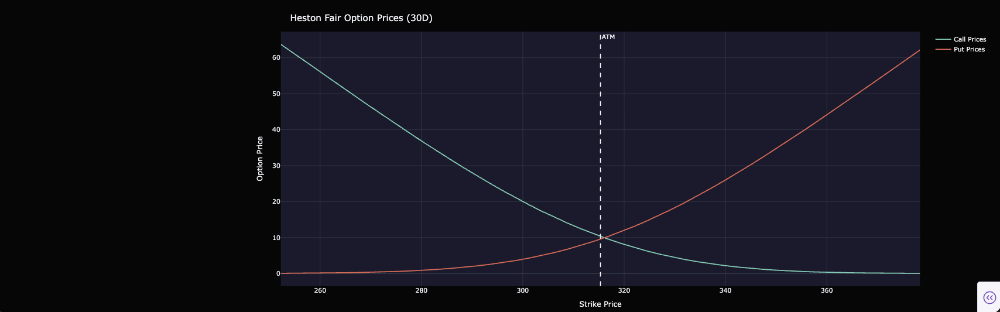

# Base-Alpha: Systematic Quantitative Research Environment

**Base-Alpha** is a modular Python-based framework designed for quantitative market analysis, regime detection, and derivative pricing. It bridges the gap between raw financial data and actionable insights by combining classical stochastic calculus with modern machine learning techniques.

---

## Preview




---

## Dashboard Overview
The web-based dashboard provides a real-time interface for market monitoring and research:
- **Regime Detection:** Visualizes market regimes (High/Low Volatility) using HMMs.
- **Price Forecasts:** Predicts future price paths based on trained XGBoost and LSTM models.
- **Option Pricing:** Heston model-based pricing for calls and puts.
- **Dynamic Metrics Header:** Displays real-time market data, including Active Ticker, Expected Move, Current Regime, and fair/implied option metrics, all dynamically updated based on user-selected horizons and expiry dates.

---

## Installation

```bash
git clone https://github.com/LeanderFrantz/base-alpha.git
cd base-alpha
pip install -r requirements.txt
python base_alpha/dashboard/app.py
```